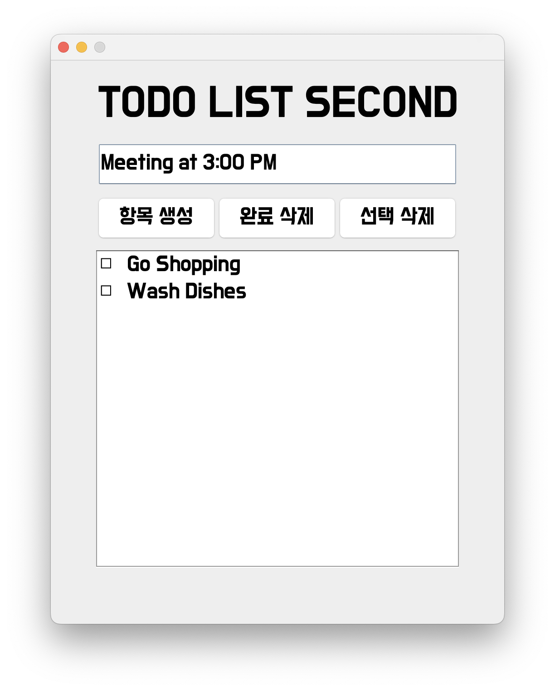

# Java Swing을 이용한 할 일 관리기 - 한국어
Java GUI Swing, 그 중에서도 ``JTable``을 활용하여 실험적으로 할 일 관리기를 만들었습니다.  
이 프로그램에서 ``JTable``은 2개의 열로 나뉘며, 1열은 체크 박스, 2열은 할 일 목록을 배치하였습니다.  
``JTable`` 위에는 3개의 ``JButton``과 1개의 ``JTextField``가 있는데, 할 일을 ``JTextField``에 입력한 후에  
``JButton``을 이용하여 추가/편집이 가능합니다.

# To Do List with Java Swing - English
I experimentally made To Do List, using Java GUI Swing, especially ``JTable``.  
The ``JTable`` of this program has 2 rows: the first row is checkboxes and the other is to-do things.  
Above the ``JTable``, there are 3 ``JButton``s and 1 ``JTextField``: you can put a to-do thing in ``JTextField`` and  
edit it via ``JButton``.

